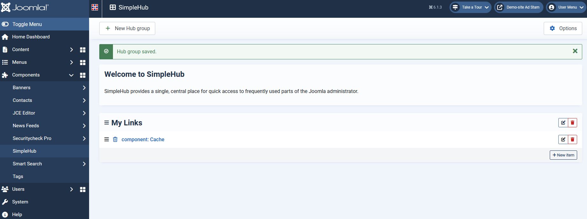
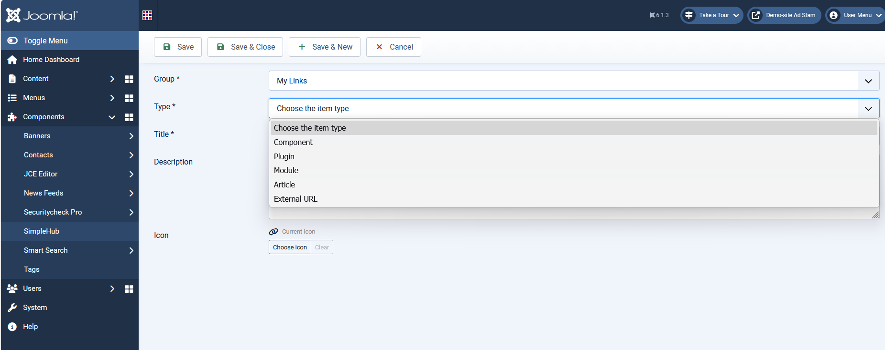
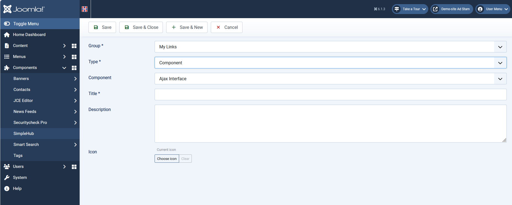
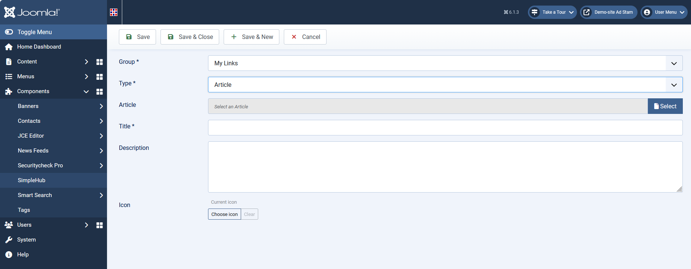
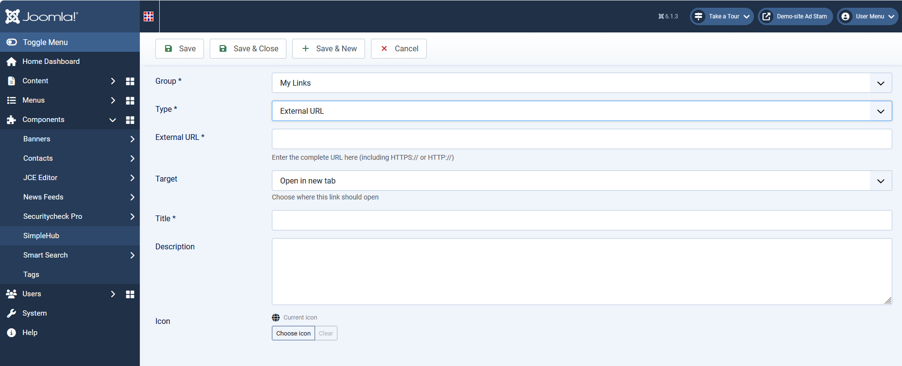
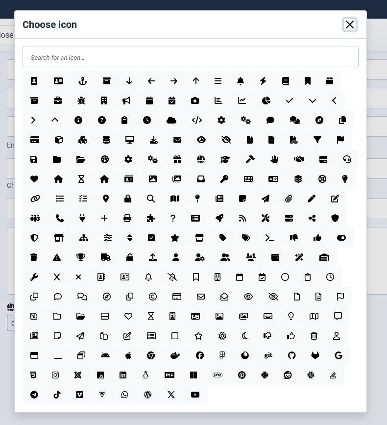

# SimpleHub

SimpleHub is een Joomla Administrator-component die een overzichtelijke hub biedt naar de
plekken in je website waar je als beheerder regelmatig moet zijn: componenten, plugins,
modules, artikelen en externe URL's. In plaats van steeds opnieuw door het Joomla-menu te
zoeken, zet je de koppelingen die je vaak gebruikt overzichtelijk bij elkaar op één
Dashboard.

## Functionaliteit

* **Dashboard met Hubgroepen.** Groepeer je snelkoppelingen in zelf te benoemen groepen
  (bijvoorbeeld "SEO", "Content" of "Onderhoud") en sleep ze in de gewenste volgorde.
* **Vijf soorten snelkoppelingen (Hub-items).** Per item kies je waar de link naartoe wijst:
  een component, een plugin, een module, een artikel, of een externe URL.
* **Automatische iconen en status.** SimpleHub herkent zelf het bijpassende icoon en toont
  wanneer een snelkoppeling niet meer beschikbaar is (bijvoorbeeld een uitgeschakelde
  plugin). Een icoon kies je desgewenst ook zelf, via een ingebouwde FontAwesome-iconkiezer.
* **Sleep-volgorde.** Zowel groepen als items binnen een groep herschik je via drag & drop.
* **Veilige externe koppelingen.** Externe URL's worden bij het opslaan gecontroleerd en
  beschermd tegen misbruik van de server (SSRF-bescherming); je kiest bovendien of een
  externe link in hetzelfde venster, een nieuw tabblad of een nieuw venster opent.
* **Robuust groepen verwijderen.** Verwijder je een groep met items, dan kun je kiezen: de
  items meeverwijderen, of eerst verplaatsen naar een andere groep.
* **Snelkoppeling in de titelbalk.** SimpleHub plaatst automatisch een klein pictogram in de
  titelbalk van de Joomla Administrator, zodat je vanaf iedere beheerpagina met één klik bij
  je Dashboard bent. Dit is naar wens uit te schakelen via de componentopties.
* **Meertalig.** De beheerinterface is beschikbaar in het Nederlands, Engels, Duits, Frans en
  Spaans.

## Installatie

1. Download de installatie-zip van de gewenste versie.
2. Log in op de Joomla Administrator en ga naar **Systeem → Installeren → Extensies**.
3. Upload en installeer de zip via **Uploaden en installeren**.
4. SimpleHub verschijnt daarna onder **Componenten → SimpleHub**, en een snelkoppeling
   verschijnt automatisch in de titelbalk.

Een update naar een nieuwere versie verloopt op dezelfde manier: opnieuw uploaden en
installeren via hetzelfde scherm. Bestaande Hubgroepen, items en instellingen blijven
daarbij behouden.

### Vereisten

* Joomla 5.4 of hoger.
* Een MySQL-compatibele database (SimpleHub gebruikt twee eigen databasetabellen).

## Gebruik

### Een Hubgroep aanmaken

Ga naar het SimpleHub Dashboard en kies **Nieuw** om een groep aan te maken. Groepen zijn
te herschikken door ze te verslepen op het Dashboard.

### Een Hub-item toevoegen

Open een groep en kies **Nieuw** om een item toe te voegen. Kies eerst het type bestemming
(component, plugin, module, artikel of externe URL) en vervolgens de concrete bestemming.

Afhankelijk van de keuze kan het scherm zich anders voordoen.

*Deze indeling bij Extensies*

*Deze indeling bij Artikelen*

*Deze indeling bij Externe URL's*

Is de titel nog leeg, dan stelt SimpleHub automatisch een titel voor op basis van je keuze.

Bij een externe URL wordt de bereikbaarheid gecontroleerd zodra je het URL-veld verlaat, en
kies je of de link in hetzelfde venster, een nieuw tabblad, of een nieuw (los) venster moet
openen.

**Andere icoon kiezen**
Als er een andere iccon gewenst is dan de standaard icoon open dan het keuze scherm voor iconen.

### Groep verwijderen

Een lege groep verwijder je direct. Bevat de groep nog items, dan krijg je de keuze om de
items mee te verwijderen, of ze eerst te verplaatsen naar een andere groep.

### Titelbalk-snelkoppeling in-/uitschakelen

Ga naar **Componenten → SimpleHub → Opties** en zet de schakelaar **Titelbalk-snelkoppeling**
aan of uit. De wijziging is direct zichtbaar, zonder dat opnieuw installeren nodig is.

## Talen

De beheerinterface is volledig vertaald naar:

* Nederlands (nl-NL)
* Engels (en-GB)
* Duits (de-DE)
* Frans (fr-FR)
* Spaans (es-ES)

Joomla kiest automatisch de taal die voor het beheeraccount is ingesteld.

## Licentie

SimpleHub is vrije software, uitgebracht onder de GNU General Public License versie 2 of
later. Zie `LICENSE.txt` voor de volledige licentietekst.

## Wijzigingen

Zie [`CHANGELOG.md`](CHANGELOG.md) voor de release notes.
